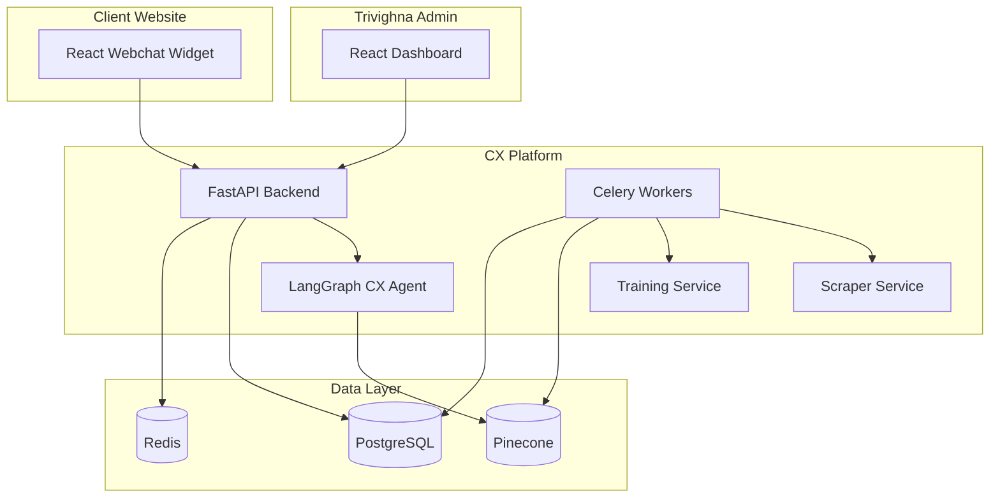

# Architecture

## System Overview

The CX Chatbot Platform is a multi-tenant B2B SaaS product. Trivighna (platform owner) sells embeddable AI chatbots to client companies. Each client's data is fully isolated.

## Component Diagram



## RAG Training Pipeline

```
Website URL ──► Scraper Service ──► raw text pages
Document    ──► Training Service /parse ──► raw text
                        │
                        ▼
              Training Service /chunk
                        │
                        ▼
              OpenAI Embeddings (text-embedding-3-small)
                        │
                        ▼
              Pinecone upsert (client namespace)
```

## Query Pipeline

```
User message ──► POST /api/chat/message
        │
        ▼
Load agent config + session history
        │
        ▼
LangGraph: cx_node → retrieve_knowledge (Pinecone query in namespace)
        │              → optional: lead capture, meeting scheduling
        ▼
SSE stream tokens ──► save messages to PostgreSQL
```

## Multi-Tenant Isolation

| Layer | Isolation Mechanism |
|---|---|
| PostgreSQL | `client_id` on all tables |
| Pinecone | One namespace per client (`client_{uuid}`) |
| Widget | `client_key` + domain whitelist |
| Chat | Queries scoped to client's namespace only |

## CX Agent Graph

Mirrors existing `agents/agents/graphs/cx/` structure:

```
START → cx_node → [tools?] → cx_tool_node → cx_node → END
```

Tools:
- `retrieve_knowledge` — Pinecone RAG (replaces `search_info`)
- `capture_lead_information` — lead capture
- `meeting_scheduling` — Cal.com integration
- `math_expression_evaluator` — safe math
